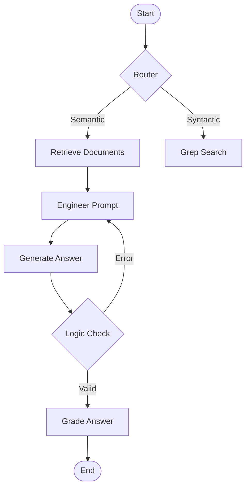

# 🚀 LLM DSL Information Extraction System

[](https://python.org)
[](https://faiss.ai)
[](https://langchain-ai.github.io/langgraph/)
[](https://groq.com)

> *Un système sophistiqué d'analyse et d'interrogation de code DSL utilisant l'IA sémantique et des workflows graphiques*

---

## 🎯 Vue d'ensemble du projet

Le **LLM DSL Information Extraction System** est une pipeline complète et modulaire conçue pour analyser, traiter et interroger intelligemment des codebases de langages spécifiques à un domaine (DSL), spécialement optimisée pour **Envision DSL** de Lokad.

Le projet a évolué vers une architecture basée sur **LangGraph**, permettant des workflows complexes, la fusion RAG, et l'évaluation automatique.

### 🔥 Fonctionnalités clés

- 🔍 **Parsing intelligent** - Analyse sémantique des fichiers `.nvn` (Envision DSL)
- 🧩 **Chunking contextuel** - Segmentation intelligente préservant la cohérence
- 🎯 **Recherche Hybride** - Combinaison de recherche vectorielle (FAISS) et syntaxique (GREP)
- 🕸️ **Architecture LangGraph** - Workflows graphiques avec boucles de correction et logique conditionnelle
- 🔄 **RAG Fusion** - Décomposition de requêtes complexes en sous-questions
- 📊 **Benchmarking intégré** - Évaluation automatique par similarité cosinus
- 🤖 **Agents IA multiples** - Support GPT-4, Gemini, Mistral et Groq avec rate limiting configurable
- ⚙️ **Configuration externalisée** - Tous les paramètres dans `config.yaml`

### 📋 Prérequis

- **Python 3.8+** avec pip et venv
- **Fichiers Envision DSL** (`.nvn`) dans le dossier `env_scripts/`
- **Clé API** pour au moins un agent (Mistral, GPT, Gemini ou Groq)
- **~500MB RAM** pour l'index vectoriel

---

## 🏗️ Architecture système

Le système propose options selon la complexité requise :

1. **`main.py`** : Pipeline linéaire simple (Router → Retrieval → Generation).
2. **`main.py --agentic`** : Workflow graphique avancé (RAG Fusion, Logic Checking, Grading).

### 🕸️ Workflow LangGraph (`main.py`)



### 📂 Structure du projet

```text
llm-DSL-info-extraction/
├── 🕸️ main.py                    # Interface avancée (Graph-based)
├── 🔧 langgraph_base.py          # Définition du graphe et des états
├── 🔨 build_index.py             # Construction d'index FAISS à base de chunks complets
├── 🔨 build_summary_index.py             # Construction d'index FAISS à base de summaries
├── ⚙️ config.yaml                # Configuration système
├── 📄 requirements.txt           # Dépendances Python
│
├── 🤖 agents/                    # Agents IA (Mistral, Gemini, GPT, Groq)
│
├── 🔄 rag/                       # Pipeline RAG modulaire
│   ├── 🏗️ core/                 # Interfaces de base
│   ├── 📄 parsers/               # EnvisionParser
│   ├── 🧩 chunkers/              # SemanticChunker
│   ├── 🎯 embedders/             # SentenceTransformerEmbedder
│   ├── 📖 summarizers/           # ChunkSummarizer
│   └── 🔍 retrievers/            # FAISSRetriever & GrepRetriever
│
├── 📊 pipeline/benchmarks/       # Outils d'évaluation
│   ├── 📐 cosine_sim_benchmark.py
│   └── 🔍 llm_as_a_judge/
│
└── 📁 env_scripts/               # Fichiers sources .nvn
```

---

## 🚀 Démarrage rapide

### 1. 📦 Installation

```bash
# Cloner le repository
git clone https://github.com/ClementLokad/llm-DSL-info-extraction.git
cd llm-DSL-info-extraction

# Créer et activer l'environnement virtuel
python -m venv env
.\env\Scripts\Activate.ps1  # Windows PowerShell
# source env/bin/activate    # Linux/Mac

# Installer les dépendances
pip install -r requirements.txt
```

### 2. ⚙️ Configuration

1. **API Keys** : Copiez `.env.example` vers `.env` et ajoutez vos clés.
2. **config.yaml** : Configurez tous les paramètres souhaités avant lancement du modèle. Si vous utilisez des API gratuites (ex: Mistral), configurez le délai dans `config.yaml` :

```yaml
agent:
  default_model: "groq"
  rate_limit_delay: 1  # Pause de 1.5s entre les appels
```

### 3. 🔨 Construction de l'index

```bash
# Construction de l'index normal avec embedding des chunks complets
python build_index.py
```

```bash
# Construction de l'index normal avec embedding des chunks résumés. Arrêt possible avec CTRL+C
python build_summary_index.py

# Reprendre le calcul de là où on en était
python build_summary_index.py

# Ecraser le summary avec un nouveau
python build_summary_index.py --rebuild

```

### 4. 🎮 Utilisation

**Flags** Les flags servant à choisir certains modes de fonctionnement écrasent les choix définis dans config.yaml. Ils ne sont pas nécessaires si la config est gérée par l'utilisateur avant exécution.

```bash
# fonction de base exécutée sans option
python main.py

# --verbose : Activer le mode verbeux (voir les étapes du graphe)
python main.py --verbose

# --agentic : Activer le mode agentique
python main.py --agentic

# --agent, -a : Choisir l'agent (gemini, gpt, mistral, llama3, groq, qwen)
python main.py --agent qwen

# --verbose, -v : Détailler les étapes bien un output verbeux
python main.py --verbose

# --quiet : Supprimer les messages d'initialisation
python main.py --quiet

# --query : Poser une seule question
python main.py --query "Combien de scripts lisent /Clean/Items.ion ?"

# --status, -s : Donner l'état de de la configuration et de l'index

# --indextype, -in : Choix de l'index utilisé pour les embeddings (full_chunk, summary)
python main.py --indextype full_chunk

# --fusion, -f --query : Activer la RAG Fusion (pour questions complexes)
python main.py --fusion --query "Explain the inventory logic and how it relates to sales"

# --benchmarkpath, -bp : Donner le nom du benchmark à effectuer
python main.py --quiet

# --benchmarktype, -bt : Donner le type de benchmark à effectuer
python main.py --benchmarkpath questions.json --benchmarktype llm_as_a_judge

# --benchmarkagent, -ba, -bt : Changer l'agent utilisé par le benchmark (si llm_as_a_judge)
python main.py --benchmarkpath questions.json --benchmarktype llm_as_a_judge -benchmarkagent mistral
```

---

## 💻 Comparaison des Modes

| Fonctionnalité          |    `main.py`    |   `main.py`   |
| :----------------------- | :---------------: | :------------------------: |
| **Architecture**   |     Linéaire     |     Graphe (LangGraph)     |
| **Complexité**    |      Faible      |          Élevée          |
| **RAG Fusion**     |        ❌        |     ✅ (`--fusion`)     |
| **Logic Checking** |        ❌        | ✅ (Boucle de correction) |
| **Benchmarking**   |        ❌        |    ✅ (`--benchmark`)    |
| **Rate Limiting**  |      Manuel      | Automatique (Configurable) |
| **Usage**          | Requêtes simples |    Analyse approfondie    |

---

## 📊 Benchmarking

Le système inclut un outil de benchmark basé sur la similarité cosinus.

1. Créez un fichier `questions.json` :
   ```json
   [
     {
       "question": "What is the main table?",
       "answer": "The main table is Orders"
     }
   ]
   ```
2. Lancez le benchmark :
   ```bash
   python main.py --benchmarkpath questions.json --benchmarktype llm_as_a_judge
   ```

---

## 🔧 Configuration avancée (`config.yaml`)

```yaml
agent:
  default_model: "groq"
  rate_limit_delay: 1.5  # Délai anti-rate-limit

parser:
  type: "envision"

chunker:
  type: "semantic"
  max_chunk_tokens: 512

retriever:
  type: "faiss"
  faiss:
    top_k: 10
```

---

## 🤝 Contribution

1. **Architecture** : Respectez la séparation `rag/` vs `agents/`.
2. **LangGraph** : Ajoutez de nouveaux nœuds dans `langgraph_base.py`.
3. **Tests** : Utilisez `test.py` pour valider les composants de base.

---

## 📝 Licence

Ce projet est sous licence PRIVATE LICENSE AGREEMENT. Voir [LICENSE](LICENSE) pour plus de détails.
