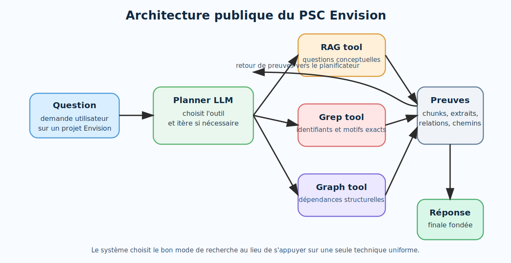

# Envision — Projet Scientifique Collectif X24

## Titre du sujet

**Architecture agentique et hybride pour l'extraction de connaissances sur une base de code propriétaire Envision**

## Composition du groupe

- Dégot-Silvestre Gaétan
- Dorchies Yoan
- Kamdem Ivann
- Thébault Guilhem
- Guediche Adam

## Partenaire

Le projet est mené en lien avec **Lokad**, entreprise spécialisée dans l'optimisation quantitative de la supply chain.  
Le code étudié repose sur **Envision**, un DSL propriétaire utilisé pour construire des applications métier de prévision, d'approvisionnement, d'allocation et de pilotage opérationnel.

## Problématique

Les grands modèles de langage sont très performants sur les langages de programmation standards, mais ils restent fragiles lorsqu'ils sont confrontés à un DSL propriétaire peu représenté dans leurs corpus d'entraînement.

Dans notre cas, la difficulté est double :

- **le langage lui-même est spécialisé** : Envision mélange manipulation tabulaire, logique procédurale contrainte et primitives de restitution métier ;
- **les données sont confidentielles** : il n'est pas envisageable d'exposer librement l'ensemble du dépôt et des données client à un assistant grand public.

Notre objectif est donc de construire un assistant capable de **retrouver, relier et expliquer** des éléments pertinents d'un projet Envision réel, tout en gardant localement le contrôle sur les données et sur la recherche d'information.

## Demarche

Le système final repose sur une architecture **hybride et agentique**.

### 1. Préparer le code pour la recherche

Les scripts Envision sont d'abord parsés en blocs syntaxiques cohérents afin d'éviter un découpage destructeur du code.  
Cette préparation alimente plusieurs outils complémentaires.

### 2. Combiner trois modes de recherche

- **RAG tool** : recherche sémantique pour les questions conceptuelles et les liens métier diffus.
- **Grep tool** : recherche lexicale exacte pour les identifiants, les chemins et les motifs syntaxiques précis.
- **Graph tool** : graphe de dépendances structurelles entre scripts, données, tables et fonctions.

### 3. Orchestrer ces outils dans une boucle agentique

Un planificateur sélectionne l'outil le plus adapté, observe le résultat obtenu, puis décide soit de répondre, soit de poursuivre l'exploration avec une nouvelle requête plus ciblée.

Cette boucle rapproche le comportement du système de celui d'un développeur humain qui navigue progressivement dans une base de code complexe.

## Resultats principaux

Le prototype actuel permet :

- de répondre à des questions techniques sur un dépôt Envision réel ;
- de distinguer les besoins de recherche sémantique, lexicale et structurelle ;
- de réduire certaines hallucinations grâce à une recherche guidée par preuves ;
- de benchmarker le système automatiquement sur un jeu de questions/réponses ;
- d'opérer sur une base locale, sans exposition brute de l'ensemble des données au modèle.

Le projet a progressivement évolué d'un moteur de recherche assisté vers une **architecture agentique modulaire**, plus robuste pour l'exploration de DSL industriels.

## Illustration

L'illustration suivante résume la logique de la solution implémentée.

*Figure — Le planificateur choisit entre recherche sémantique, lexicale et structurelle, puis agrège les preuves avant génération de la réponse finale.*

## Liens du projet

- Dépôt principal : [github.com/ClementLokad/llm-DSL-info-extraction](https://github.com/ClementLokad/llm-DSL-info-extraction)
- Page publique : [kpihx.github.io/envision-copilot-presentation](https://kpihx.github.io/envision-copilot-presentation/)

## Navigation

Les pages complémentaires du site détaillent :

- le cadrage du problème ;
- la méthodologie technique ;
- les progrès réalisés depuis le rapport intermédiaire ;
- les principales références administratives et techniques.
