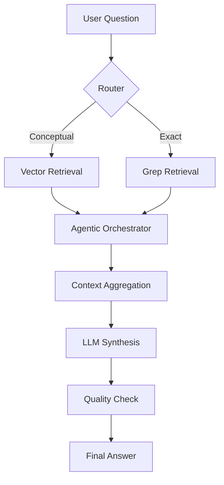

# Public Page - PSC X24

## Project Title

**Agentic and Hybrid Architecture for Knowledge Extraction on Proprietary Codebases (Envision)**

## Team Composition

- Degot-Silvestre Gaetan
- Dorchies Yoan
- Kamdem Ivann
- Thebault Guilhem
- Guediche Adam

## Academic Positioning

This page is the public communication page of the PSC finalization phase for project **Envision**.
It is aligned with PSC requirements for final delivery:

- final report submission (30-40 pages);
- public page containing team composition, project title, and at least one illustration;
- final oral presentation in front of the jury.

## Project Scope and Objective

The project addresses a practical limitation of standard LLM systems in industrial contexts: proprietary DSLs
are not present in public pre-training corpora and therefore trigger frequent hallucinations.

Our objective is to design and evaluate a robust assistant capable of answering technical questions on
Lokad's Envision codebase by combining:

- semantic retrieval for conceptual questions;
- exact lexical retrieval for variable/path-level questions;
- agentic orchestration to iterate until sufficient evidence is collected.

## Current System (Main Branch Status)

The implementation has progressed beyond the intermediate report and currently includes:

- hybrid retrieval stack (vector retrieval + grep-based retrieval);
- query routing between conceptual and exact search modes;
- agentic workflow with iterative reasoning and tool calls;
- benchmarking and grading pipeline;
- live interaction mode with persistent memory and context compaction;
- configuration-driven execution and multi-model support.

## Methodology Highlights

- **Data preparation:** parser and semantic chunking adapted to Envision scripts.
- **Retrieval architecture:** hybrid route to reduce both false positives and false negatives.
- **Agentic control:** looped workflow for planning, retrieval, synthesis, and verification.
- **Evaluation:** benchmark-first approach with quality and operational metrics.

## Illustration

## Key Dates

- Final report deadline: **2026-04-24**
- Final presentation period: **May 2026**
- Scheduled soutenance (TickTick): **2026-05-19 15:00** (Europe/Paris)

## Source Documents

- `source/Livret_PSCX24.pdf`
- `source/PSC_Rapport_Intermediaire_X24.pdf`
