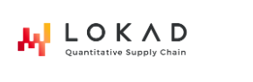

# PSC INF01
> **Architecture Agentique et Hybride pour l'Extraction de Connaissances sur Code Propriétaire (Envision)**

## 🚀 Présentation du Projet
Dans le cadre du **PSC X24** à l'École Polytechnique et en partenariat avec **Lokad**, l'équipe **INF01** a développé une infrastructure agentique intelligente pour naviguer dans des bases de code complexes écrites en **Envision**.

Notre solution permet d'automatiser l'extraction de connaissances techniques en combinant recherche sémantique, analyse de graphes et outils de recherche lexicale, le tout orchestré par un agent capable de raisonnement itératif.

---

## 🏛️ Architecture & Composants
Le projet est structuré autour d'un pipeline modulaire (LangGraph) intégrant des outils spécialisés :

- **[Architecture Sémantique (RAG)](technical/implementation.md#rag)** : Indexation multi-modale (chunking hybride) située dans `rag/`.
- **[Graphe de Dépendances](technical/implementation.md#graph)** : Analyse statique du code Envision pour extraire les liens structurels (`env_graph/`).
- **[Workflow Agentique](workflow/pipeline.md)** : État de l'agent et boucles de feedback (`pipeline/agent_workflow/`).

---

## 👥 L'Équipe INF01
- **Gaétan Dégot--Silvestre**
- **Yoan Dorchies**
- **Ivann Kamdem**
- **Guilhem Thébault**
- **Adam Guediche** [GitHub](https://github.com/ClementLokad/llm-DSL-info-extraction)

---

## 📚 Explorer la Documentation
Utilisez les sections suivantes pour approfondir votre compréhension du système :
- [**Architecture Globale**](architecture/overview.md) : Vision d'ensemble et pipeline de données.
- [**Flux de Travail (Workflow)**](workflow/pipeline.md) : Comment l'agent résout une question.
- [**Spécifications Techniques**](technical/tools.md) : Stack technologique et librairies utilisées.
- [**Gestion de Projet**](project/management.md) : Méthodologie, jalons et livrables.

---
 
