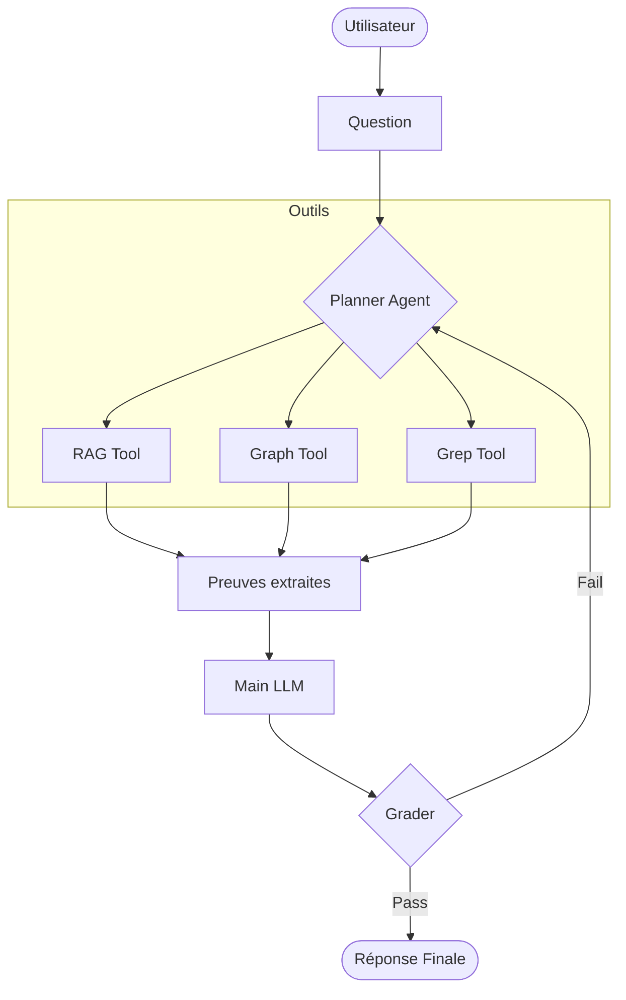

# Architecture Globale

Le projet **INF01** repose sur une architecture hybride conçue pour surmonter les limites des LLM sur les langages propriétaires. Contrairement à une approche RAG classique, nous utilisons un **Agent** capable de naviguer dynamiquement dans plusieurs sources d'information.

## 🏗️ Structure du Système

Le système est divisé en trois piliers principaux, chacun correspondant à un module spécifique du code :

### 1. Le Moteur Sémantique ([`rag/`](https://github.com/Kpihx/envision/tree/main/envision/rag))
Ce module gère l'ingestion et la recherche d'information textuelle.
- **Parsers** : Découpage intelligent du code Envision en conservant le contexte fonctionnel.
- **Embeddings** : Utilisation de modèles spécialisés pour transformer le code en vecteurs.
- **Retriever** : Recherche par similarité cosinus pour trouver les concepts pertinents.

### 2. L'Analyse Statique ([`env_graph/`](https://github.com/Kpihx/envision/tree/main/envision/env_graph))
Le code Envision est modélisé par un graphe dirigé.
- **Noeuds** : Scripts, variables, fonctions.
- **Arêtes** : Dépendances (`read`, `write`, `call`).
- **Outil** : Permet à l'agent de suivre la trace d'une variable à travers plusieurs fichiers.

### 3. Le Pipeline Agentique ([`pipeline/`](https://github.com/Kpihx/envision/tree/main/envision/pipeline))
Basé sur **LangGraph**, ce module définit le cycle de vie de la résolution.
- **State Management** : Suivi des découvertes de l'agent.
- **Workflow Tools** : Interface entre l'agent et les outils (`rag_tool`, `grep_tool`, `graph_tool`).

## 📊 Pipeline de Données

Le schéma ci-dessous illustre le flux d'information de la question utilisateur vers la réponse finale :

## 📂 Mapping de la Codebase

| Fonctionnalité | Dossier Source | Fichiers Clés |
| :--- | :--- | :--- |
| **Cœur de l'Agent** | [`agents/`](https://github.com/Kpihx/envision/tree/main/envision/agents) | `claude_agent.py`, `base.py` |
| **State Machine** | [`pipeline/agent_workflow/`](https://github.com/Kpihx/envision/tree/main/envision/pipeline/agent_workflow) | `agentic_pipeline.py`, `concrete_workflow.py` |
| **Outils (Tools)** | [`pipeline/agent_workflow/`](https://github.com/Kpihx/envision/tree/main/envision/pipeline/agent_workflow) | `rag_tool.py`, `graph_tool.py`, `grep_tool.py` |
| **Indexation RAG** | [`rag/`](https://github.com/Kpihx/envision/tree/main/envision/rag) | `build_index.py`, `core/` |
